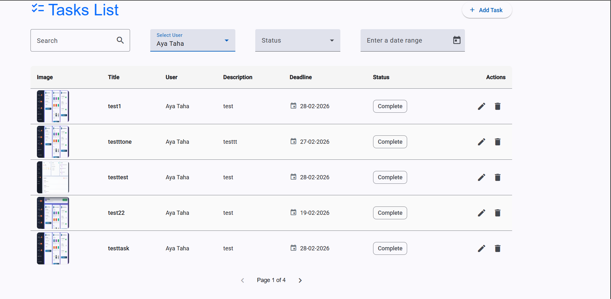
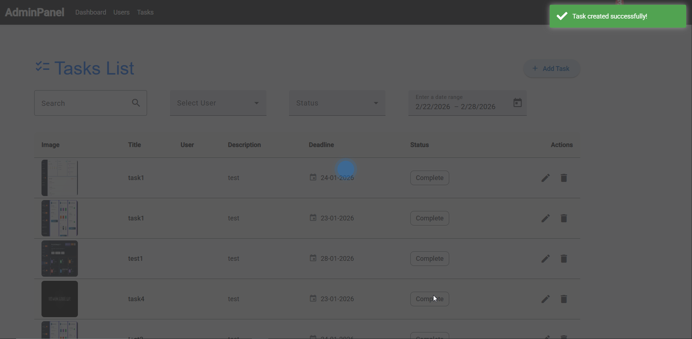
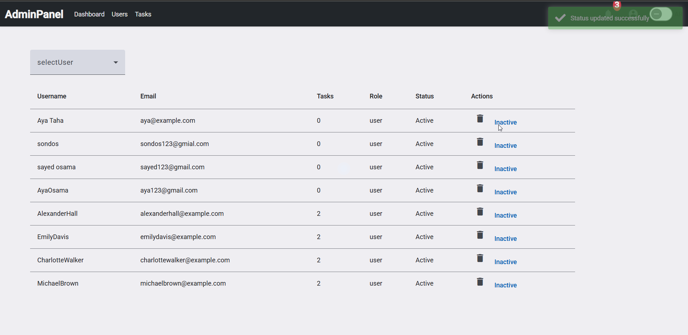
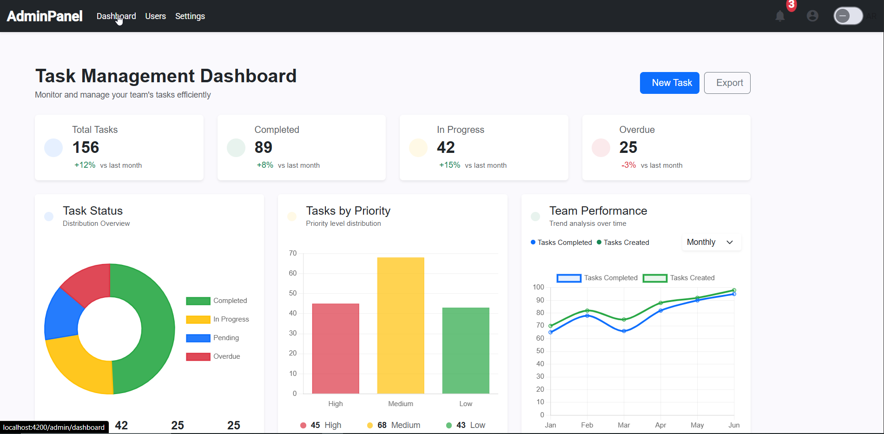

# Task Manager – Full Stack (Angular + Node.js)

A **full-stack task management system** built with **Angular 21 (Frontend)** and **Node.js (Backend)**.
The workspace contains **two separate Angular applications**:

- **Admin Dashboard** – manage users, tasks, and view analytics
- **User App** – manage personal tasks, with full CRUD operations

Shared services, interfaces, and utilities are stored in a **shared folder** for code reusability.

---

## 🚀 Features

### 👤 User Application

- User authentication (login/register)
- Create, read, update, delete tasks (CRUD)
- Task status management (pending / completed)
- Pagination for task lists
- Multi-language support (i18n)
- Responsive UI for mobile and desktop

### 🛠 Admin Dashboard

- Manage all users (CRUD)
- View and manage all tasks across the platform
- Dashboard charts & statistics (using Chart.js and Highcharts)
- Role-based access control
- Loading indicators and toast notifications

---

## 🧱 Tech Stack

### Frontend

- **Angular 21** – robust frontend framework
- **Angular Material** – UI components
- **Bootstrap 5** – responsive design
- **RxJS** – reactive programming
- **ngx-translate/core** – multi-language support
- **ngx-pagination** – pagination
- **ngx-spinner** – loading indicators
- **ngx-toastr** – toast notifications
- **Chart.js / ng2-charts** – charts
- **Highcharts / highcharts-angular** – interactive charts
- **Moment.js** – date handling

### Backend

- **Node.js + Express.js** – RESTful API
- **Authentication & Authorization** (JWT)
- **Database**: MySQL / MongoDB (adjust according to your setup)

---

## 📂 Project Structure

```text
my-workspace/
├── admin-app/       # Angular Admin Dashboard
├── user-app/        # Angular User Application
├── shared/          # Shared services, interfaces, and utilities
├── backend/         # Node.js API
└── package.json     # Shared dependencies and scripts
```

⚙️ Installation & Setup
1️⃣ Clone the Repository
git clone https://github.com/Aya123O/task-manager-fullstack-angular-node.git
cd task-manager-fullstack-angular-node

```

2️⃣ Install Dependencies
npm install
```

3️⃣ Run Frontend (Angular Apps)

By default, the user-app will be served:

npm start

To run the Admin Dashboard, navigate to the admin folder and run:

cd admin-app
ng serve

Open your browser at: http://localhost:4200

```

4️⃣ Run Backend (Node.js API)
cd backend
npm install
npm run dev


The backend server will run at: http://localhost:3000

Ensure both frontend and backend are running simultaneously for full functionality.
```

## 📸 Admin Dashboard Screenshots

<table>
  <tr>
    <td align="center">
      <br>
      Task List / قائمة المهام
    </td>
    <td align="center">
      <br>
      Tasks Management / إدارة المهام
    </td>
    <td align="center">
      <br>
      Task List / قائمة المهام
    </td>
  </tr>
  <tr>
    <td align="center">
      <br>
      Task List with Pagination / قائمة المهام مع الترقيم
    </td>
    <td align="center">
      <br>
      Add / Edit Task / إضافة / تعديل مهمة
    </td>
    <td align="center">
      <br>
      Close without saving / إغلاق بدون حفظ التغييرات
    </td>
  </tr>
  <tr>
    <td align="center">
      <br>
      Notification Task updated / إشعار: تم تعديل المهمة
    </td>
    <td align="center">
      <br>
      Notification Task Deleted / إشعار: تم حذف المهمة
    </td>
    <td align="center">
      <br>
Translate Tasks / ترجمة المهام
   </td>
  </tr>
  <tr>
    <td align="center">
      <br>
       user status updated / تعديل حالة اليوزر
    </td>
    <td align="center">
      <br>
      Login / تسجيل الدخول
    </td>
    <td align="center">
      <br>
      Statistics Overview / نظرة عامة على الإحصائيات
    </td>
  </tr>
  <tr>
    <td align="center">
      <br>
      Statistics Overview / نظرة عامة على الإحصائيات
    </td>
  </tr>
</table>

## 📸 User App Screenshots

<table>
  <tr>
    <td align="center">
      <br>
      Login / تسجيل الدخول
    </td>
    <td align="center">
      <br>
      Display User Tasks / عرض مهام المستخدم
    </td>
    <td align="center">
      <br>
      Completed Tasks / المهام المكتملة
    </td>
  </tr>
  <tr>
    <td align="center">
      <br>
      Completed Tasks / المهام المكتملة
    </td>
    <td align="center">
      <br>
      Task Details / تفاصيل المهمة
    </td>
  </tr>
</table>
```

✅ Notes

Node.js (v18+) and npm (v10+) are required.

Update environment variables in the backend if needed (.env file).

Frontend and backend communicate via RESTful APIs.

For production, build Angular apps using ng build --configuration production.

🧪 Testing & Formatting

Vitest – Unit testing

Prettier – Code formatting with Angular rules

👩‍💻 Author

Aya Osama

GitHub: Aya123O

```

```
